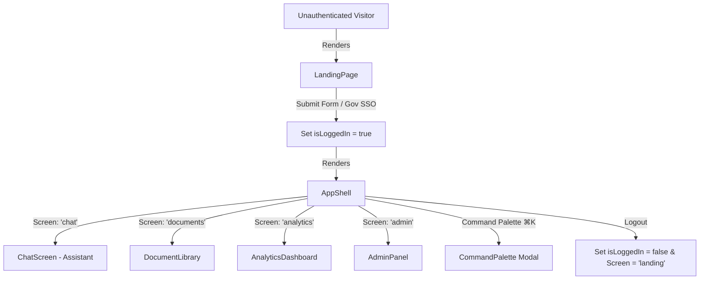

# HTE AI Assistant — Frontend Technical Documentation

Welcome to the frontend documentation for the **HTE AI Assistant** application. This document provides a complete technical reference for developers, designers, and maintainers working on the user interface and frontend architecture.

---

## 1. Executive Summary

The **HTE AI Assistant** is an AI-powered policy intelligence and administrative web platform built for the **Higher & Technical Education (HTE) Department, Government of Maharashtra**. It allows students, faculty members, departmental officers, and administrators to query HTE guidelines, scholarship rules, AICTE circulars, UGC norms, and state education acts using natural language, backed by verifiable source citations.

---

## 2. Technology Stack

| Layer | Technology / Library | Description |
|---|---|---|
| **Framework** | Next.js 16.2.6 (App Router) | React framework providing SSR/SSG capabilities and modern bundling |
| **UI Library** | React 19 | Core UI component framework |
| **Language** | TypeScript 5.7.3 | Type safety across components and data interfaces |
| **Styling** | Tailwind CSS v4 & PostCSS | Utility-first CSS engine with OKLCH dynamic color token system |
| **Animations** | Framer Motion 12.42.2 | Fluid view transitions, drawer slides, and micro-interactions |
| **Icons** | Lucide React 1.16.0 | Modern SVG icons |
| **Charts** | Recharts 3.10.1 | Responsive analytics data visualizations (Area, Bar, Line, Pie) |
| **Markdown** | React Markdown 10.1.0 & remark-gfm | Formatted AI response rendering with GitHub Flavored Markdown support |
| **UI Primitives** | Radix UI & Base UI | Accessible dialogs, dropdowns, tooltips, and tab primitives |

---

## 3. Project Directory Structure

```text
hte-ai-assistant/
├── app/
│   ├── globals.css          # Design tokens, OKLCH color palette, AI markdown typography
│   ├── layout.tsx           # Root layout, Google Fonts (Inter, JetBrains Mono), metadata
│   └── page.tsx             # Main screen router & auth state container ('use client')
├── components/
│   ├── admin/
│   │   └── AdminPanel.tsx   # User management table, role metrics, permissions matrix
│   ├── analytics/
│   │   └── AnalyticsDashboard.tsx # Recharts usage insights & SLA monitoring dashboard
│   ├── chat/
│   │   ├── ChatMessage.tsx  # Markdown message bubble with sources & confidence badge
│   │   ├── ChatScreen.tsx   # Main Q&A assistant workspace with stream simulation
│   │   ├── ChatSidebar.tsx  # Sidebar listing recent conversations
│   │   └── SourceCard.tsx   # Expandable citation card with page & section references
│   ├── documents/
│   │   └── DocumentLibrary.tsx # Grid/List doc viewer, filters, drawer & drop-zone
│   ├── landing/
│   │   └── LandingPage.tsx  # Hero landing page, Gov SSO & credentials authentication
│   ├── layout/
│   │   ├── AppShell.tsx     # Application shell (topbar, mobile sidebar, main area)
│   │   └── CommandPalette.tsx # Global Cmd+K / Ctrl+K search launcher modal
│   └── ui/
│       └── button.tsx       # Reusable button primitive (CVA)
├── lib/
│   ├── mock-data.ts         # TypeScript interfaces & dataset for HTE policy domain
│   └── utils.ts            # Classnames merger helper (clsx + tailwind-merge)
├── components.json          # Shadcn component configuration
├── next.config.mjs          # Next.js build configuration
├── package.json             # Dependencies and build scripts
└── tsconfig.json            # TypeScript compiler configuration
```

---

## 4. Architecture & Navigation Flow

### 4.1 State-Driven Screen Routing
Rather than using server-side URL routing for internal views, the application operates as a high-performance **Single-Page Application (SPA)** managed at the top-level by [app/page.tsx](file:///c:/Users/TANISH%20PAREKH/Downloads/hte-ai-assistant/app/page.tsx).

- **Screen State**: `AppScreen = 'landing' | 'chat' | 'documents' | 'analytics' | 'admin'`
- **Auth State**: `isLoggedIn: boolean`



---

## 5. Detailed Component Breakdown

### 5.1 Landing Page (`components/landing/LandingPage.tsx`)
- **Hero Section**: Features gradient accents, animated grid background, quick policy tag chips, and departmental trust metrics.
- **Authentication**:
  - **Maha-SSO**: Single Sign-On button for Government of Maharashtra portal integration.
  - **Credentials Form**: Email and password input with toggleable password visibility and demo mode hint.

### 5.2 Application Shell (`components/layout/AppShell.tsx`)
- **Topbar Header**: Department branding logo, dynamic breadcrumbs, navigation items, search trigger button with `⌘K` badge, notifications icon, and logout control.
- **Responsive Mobile Navigation**: Slide-out backdrop drawer powered by Framer Motion.
- **Screen Switcher**: Smooth fade/slide transitions when toggling between active views (`AnimatePresence`).

### 5.3 Global Command Palette (`components/layout/CommandPalette.tsx`)
- Triggered globally via key listener (`⌘K` / `Ctrl+K`).
- Instant fuzzy filtering across navigation routes, recent conversations, and indexed documents.
- Full keyboard navigation support (Up/Down arrow keys, Enter to execute, Escape to dismiss).

### 5.4 AI Assistant Workspace (`components/chat/`)
- **`ChatScreen.tsx`**: Main assistant controller handling:
  - Simulated streaming responses (character-by-character typing effect).
  - Animated thinking indicator while querying the knowledge base.
  - Collapsible left conversation history sidebar (`ChatSidebar.tsx`).
  - Right-side session sources drawer listing active document references (`SourceCard.tsx`).
  - Quick-start suggested prompts for first-time users.
- **`ChatMessage.tsx`**: Message bubble renderer featuring:
  - **Confidence Badges**: High (green check), Medium (amber warning), None (gray).
  - **Citations Accordion**: Lists source title, page number, section, and text snippet.
  - **Action Controls**: Copy to clipboard, Bookmark message, Regenerate response, Export.
  - **Follow-up Chips**: One-click suggested follow-up queries.

### 5.5 Document Library (`components/documents/DocumentLibrary.tsx`)
- **View Modes**: Switchable Grid view and List view layouts.
- **Drag-and-Drop Upload**: Drop-zone supporting PDF, DOCX, and XLSX file ingestion.
- **Filtering & Search**: Real-time keyword filter by title, summary, category, or tags, plus status filters (`Indexed`, `Processing`, `Failed`).
- **Document Detail Drawer**: Slide-over panel displaying AI-generated summaries, metadata (pages, file size, upload date), version history, and related documents.

### 5.6 Analytics Dashboard (`components/analytics/AnalyticsDashboard.tsx`)
- **KPI Summary Cards**: Total Documents, Total Queries, Avg Response Time, and Active Users with month-over-month trend indicators.
- **Interactive Visualizations (Recharts)**:
  - *Query & User Trends*: Dual-area gradient chart showing usage growth.
  - *Category Distribution*: Donut pie chart representing document categorization.
  - *Top Questions*: Horizontal bar chart ranking common inquiries.
  - *Most Viewed Documents*: Bar chart of high-traffic circulars.
  - *Response Time*: Line chart tracking daily latency against the SLA target (≤ 2.0s).

### 5.7 Admin Panel (`components/admin/AdminPanel.tsx`)
- **User Directory**: Data table displaying user avatars, roles, departments, active status, last activity, and query volume.
- **Data Controls**: Sorting by columns, multi-criteria filtering, and multi-select checkbox state for bulk actions (Deactivate, Change Role, Delete).
- **Role Permissions Matrix**: Visual summary of feature access per role (`Admin`, `Officer`, `Faculty`, `Student`).

---

## 6. Core Data Models (`lib/mock-data.ts`)

```typescript
// User Roles & Document Status Types
export type Role = 'Student' | 'Faculty' | 'Officer' | 'Admin'
export type DocStatus = 'Indexed' | 'Processing' | 'Failed'
export type ConfidenceLevel = 'high' | 'medium' | 'none'

// Source Citation
export interface Source {
  id: string
  title: string
  type: 'PDF' | 'DOCX' | 'Circular'
  page: string
  section: string
  snippet: string
}

// Chat Message
export interface Message {
  id: string
  role: 'user' | 'assistant'
  content: string
  timestamp: Date
  sources?: Source[]
  confidence?: ConfidenceLevel
  followUps?: string[]
  bookmarked?: boolean
}

// Conversation Thread
export interface Conversation {
  id: string
  title: string
  preview: string
  timestamp: Date
  messageCount: number
  messages: Message[]
}

// Document Metadata
export interface Document {
  id: string
  title: string
  category: string
  uploadDate: string
  status: DocStatus
  fileType: 'PDF' | 'DOCX' | 'XLSX'
  fileSize: string
  pages: number
  summary: string
  tags: string[]
  versions: number
}

// Platform User
export interface User {
  id: string
  name: string
  email: string
  role: Role
  department: string
  status: 'Active' | 'Inactive' | 'Pending'
  lastActive: string
  queriesThisMonth: number
  avatar: string
}
```

---

## 7. Styling & Design System (`app/globals.css`)

The application implements a modern **OKLCH color space theme**, ensuring high contrast, accessibility, and sleek dark mode compatibility.

### Key CSS Tokens
- `--primary`: OKLCH indigo base (`oklch(0.52 0.24 264)`)
- `--background`: Clean light gray (`oklch(0.98 0.005 264)`) / Sleek deep dark (`oklch(0.12 0.02 264)`)
- `--card`: High-clarity elevated surfaces (`oklch(1 0 0)` / `oklch(0.16 0.02 264)`)
- `--font-sans`: Inter font family
- `--font-mono`: JetBrains Mono font family for code & numerical metrics

---

## 8. Integration Guide for Real Backend APIs

To transition from mock data to a live backend (RAG backend / Python FastAPI / Node.js API), update the following files:

1. **AI Chat Streaming (`components/chat/ChatScreen.tsx`)**:
   - Replace `simulateStream()` with a `fetch()` request consuming an `EventSource` or Server-Sent Events (SSE) stream endpoint:
   ```typescript
   const response = await fetch('/api/v1/chat/stream', {
     method: 'POST',
     headers: { 'Content-Type': 'application/json' },
     body: JSON.stringify({ message: text, conversation_id: currentConvId })
   });
   ```

2. **Document Ingestion (`components/documents/DocumentLibrary.tsx`)**:
   - Connect the drop-zone to standard `FormData` POST uploads to your vector database pipeline.

3. **Analytics API (`components/analytics/AnalyticsDashboard.tsx`)**:
   - Replace static data constants with `SWR` or `React Query` hooks fetching real metrics from `/api/v1/analytics`.

---

## 9. Development Scripts

```bash
# Install dependencies
pnpm install

# Start local development server
pnpm dev

# Build for production
pnpm build

# Start production server
pnpm start

# Run ESLint check
pnpm lint
```
